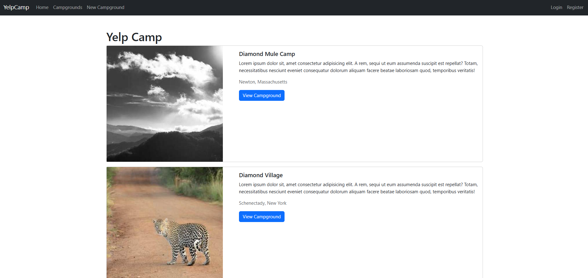

# YelpCamp



YelpCamp is a full-stack web application that allows users to discover, review, and share campground experiences. Built with Node.js, Express, and MongoDB, it provides a platform for camping enthusiasts to explore and contribute to a growing database of campgrounds.

## Features

- **User Authentication**
  - Secure user registration and login system
  - Password encryption using Passport.js
  - User profiles with personal information

- **Campground Management**
  - Create, read, update, and delete campgrounds
  - Image upload for campground photos
  - Location-based campground information
  - Pricing and description details

- **Review System**
  - Add and delete reviews for campgrounds
  - Rating system (1-5 stars)
  - User-specific review management

- **Authorization**
  - Protected routes for authenticated users
  - User-specific permissions for editing/deleting
  - Admin privileges for content moderation

## Technologies Used

- **Frontend**
  - HTML5, CSS3, JavaScript
  - Bootstrap 5
  - EJS templating

- **Backend**
  - Node.js
  - Express.js
  - MongoDB
  - Mongoose ODM

- **Authentication & Security**
  - Passport.js
  - Express-session
  - JOI validation
  - Flash messages

## Installation

1. Clone the repository
   ```bash
   git clone https://github.com/your-username/yelpcamp.git
   ```

2. Install dependencies
   ```bash
   cd yelpcamp
   npm install
   ```

3. Set up MongoDB
   - Make sure MongoDB is installed and running on your system
   - The application will connect to `mongodb://localhost:27017/yelp-camp`

4. Start the application
   ```bash
   node app.js
   ```

5. Visit `http://localhost:3000` in your browser

## Usage

1. Register a new account or login
2. Browse existing campgrounds
3. Create your own campground listings
4. Leave reviews on campgrounds
5. Edit/Delete your campgrounds and reviews
6. View your profile and manage your content

## Contributing

1. Fork the repository
2. Create your feature branch (`git checkout -b feature/AmazingFeature`)
3. Commit your changes (`git commit -m 'Add some AmazingFeature'`)
4. Push to the branch (`git push origin feature/AmazingFeature`)
5. Open a Pull Request

## License

This project is licensed under the MIT License - see the [LICENSE](LICENSE) file for details.

## Acknowledgments

- Built as part of Colt Steele's Web Developer Bootcamp
- Images provided by [Lorem Picsum](https://picsum.photos/)
- Special thanks to the Node.js and MongoDB communities 